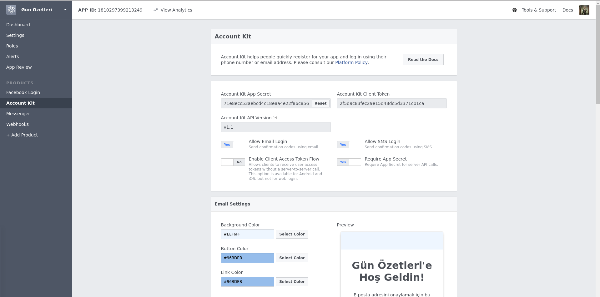
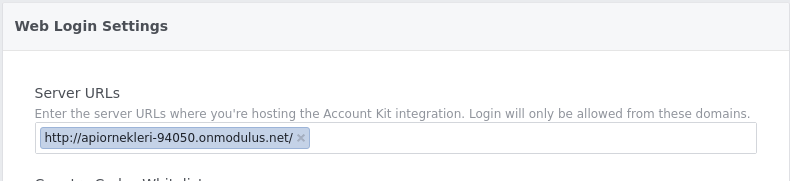
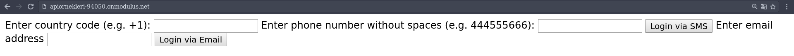
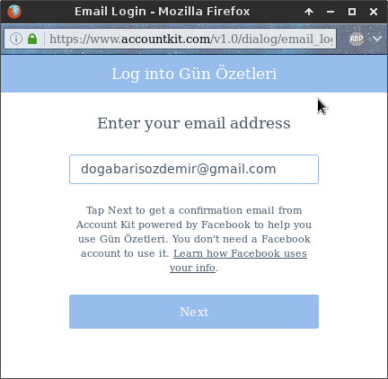
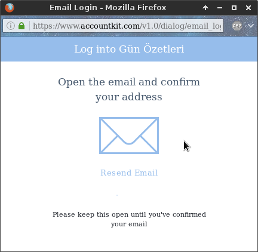
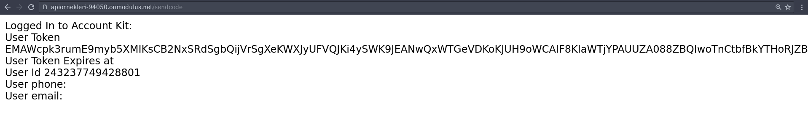
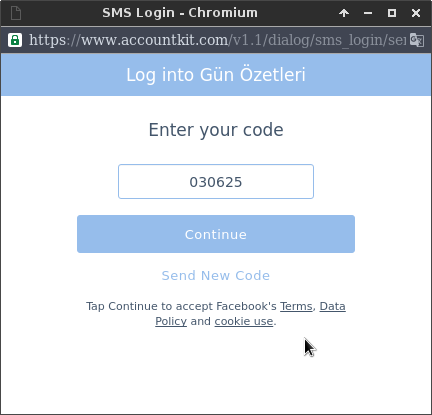

=  Account Kit  
    node install fs
    node install guid
    node install express
    node install body-parser
    node install mustache
    node install request
    node install querystring
    
Gerekli paketler proje dizinine kuruldu. Gün Özetleri uygulamasına Account Kit eklendi.

[source,]
----
var csrf_guid = Guid.raw();
const api_version = "v1.1";
const app_id = 1810297399213249;
const app_secret = '71e8ecc53aebcd4c18e8a4e22f86c856';
const me_endpoint_base_url = 'https://graph.accountkit.com/v1.1/me';
const token_exchange_base_url = 'https://graph.accountkit.com/v1.1/access_token';
----

Uygulamanın bilgileri değişkenlere atıldı. 

[source,]
----
function loadLogin() {
  return fs.readFileSync('view/login.html').toString();
}

app.get('/', function(request, response){
  var view = {
    appId: app_id,
    csrf: csrf_guid,
    version: api_version,
  };

  var html = Mustache.to_html(loadLogin(), view);
  response.send(html);
});
----

login.html header'ına account kit sdk'sı dahil edilidi. Doğrulamayı sağlayacak fonksiyonlar yazıldı.

[source,]
----

----

login.html sayfası index olarak gösterildi. Doğrulama işlemi doğru sonlandıysa Facebook'tan id'ler ve tokenler alındı. 

[source,]
----
var me_endpoint_url = me_endpoint_base_url + '?access_token=' + respBody.access_token;
  Request.get({url: me_endpoint_url, json:true }, function(err, resp, respBody) {
    // send login_success.html
    console.log(respBody);
    if (respBody.phone) {
      view.phone_num = respBody.phone.number;
    } else if (respBody.email) {
      view.email_addr = respBody.email.address;
    }
    var html = Mustache.to_html(loadLoginSuccess(), view);
    response.send(html);
  });
----

login.html body tagina buttonlar ve textboxlar eklendi.

[source,]
----
Enter country code (e.g. +1):
<input type="text" id="country_code" />
Enter phone number without spaces (e.g. 444555666):
<input type="text" id="phone_num"/>
<button onclick="phone_btn_onclick();">Login via SMS</button>
Enter email address
<input type="text" id="email"/>
<button onclick="email_btn_onclick();">Login via Email</button>
----

Doğrulama işlemi başarılı olduğunda serverurl.com/sendcode adresine istekte bulunması için gizli bir form oluşturuldu. 

[source,]
----
<form id="my_form" name="my_form" action="/sendcode" method="POST" style="display: none;">
    <input type="text" id="code" name="code">
    <input type="text" id="csrf_nonce" name="csrf_nonce">
    <input type="submit" value="Submit">
</form>
----

Server URL olarak serverın çalıştığı URL dahil edildi. 

login.html oluşturuldu. Sms ya da E-mail girişi için gerekli kolonlar oluşturuldu.

Mail adresi girilip Login via Email buttonuna tıklanıldığında pop-up çıkarıldı. Next'e basıldığında Uygulamaya giriş yapmayı sağlayan aktivasyon maili gönderildi.

Aktivasyon mailinde verilen linke tıklanıldığında Gün Özetleri Uygulamasına şifresiz giriş yapıldı.

Giriş yapıldığında login_success.html sayfasına yönlendirildi. Kullanıcı bilgileri gösterildi.

Sms ile giriş yapmak için pop-up gösterildi. Telefona gönderilen kod girildiğinde login_success.html sayfasına yönlendirildi ve kullanıcı bilgileri gösterildi.

