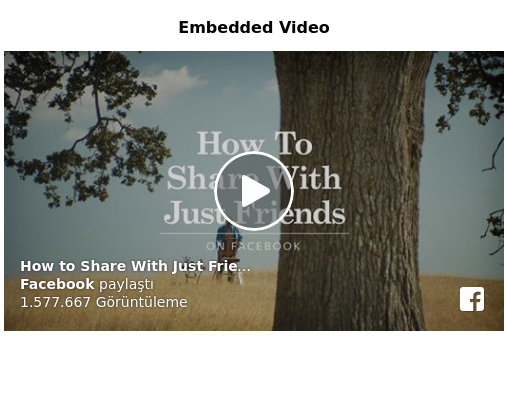
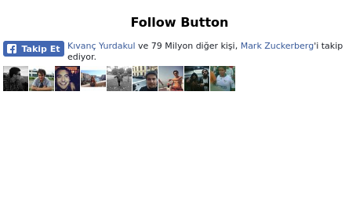
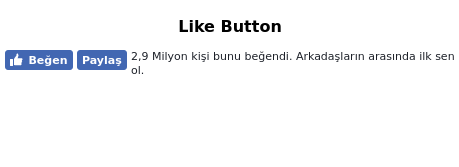
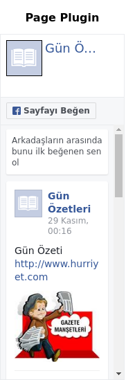
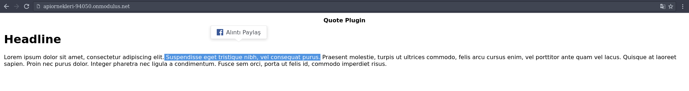
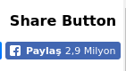

    node socialplugins.js
    
Proje dizininde açılan terminalde yukarıdaki komut girilerek server localhost üzerinde çalıştırılabilir. 

[source,]
----

----

index.html'in head kısmında facebook sdksı çağrıldı. Social Pluginlerin yan yana gösterilmesi için table oluşturuldu. 

[source,]
----
<table border="0.5">
  <tr>
    <th>Comments</th>
    <th>Embedded Comment</th>
    <th>Embedded Post</th>
    <th>Embedded Video</th>
    <th>Follow Button</th>
    <th>Like Button</th>
    <th>Page Plugin</th>
    <th>Quote Plugin</th>
    <th>Save Button</th>
    <th>Send Button</th>
    <th>Share Button</th>
  </tr>
----

Tablo sütunlarında divler oluşturuldu, oluşturulan divlere class etiketleri eklendi,classlar facebook classlarına göre çağrılarak çalıştırılacak pluginler seçildi. Örneğin;

[source,]
----
<td>

</td>
----

Comments plugini için fb-comments classı eklendi. Div tagları apide kullanmaya olanaklı taglere göre değiştirilerek istenilen bilgilerin ve görselliğin verilmesi sağlanabilir.

