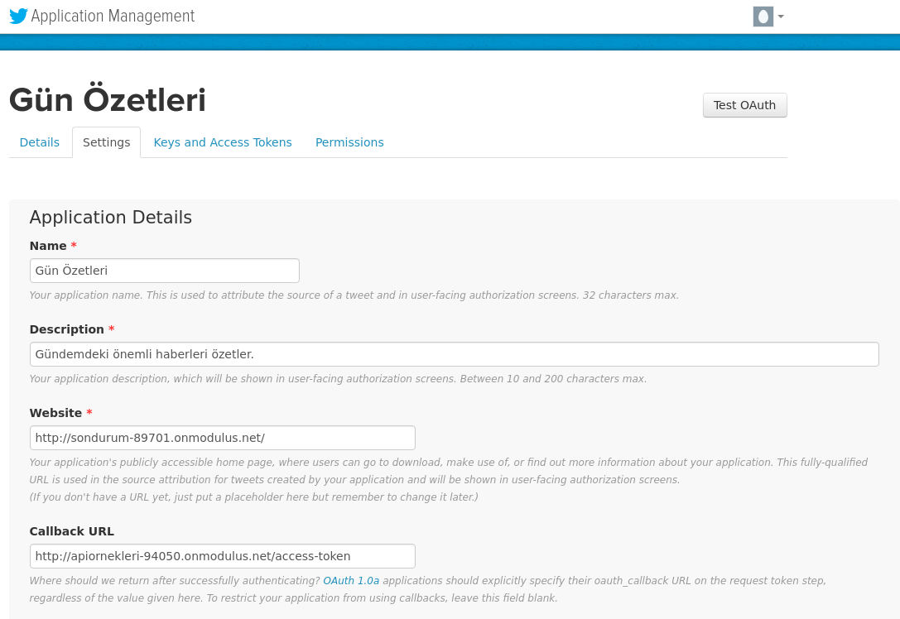
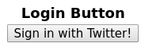
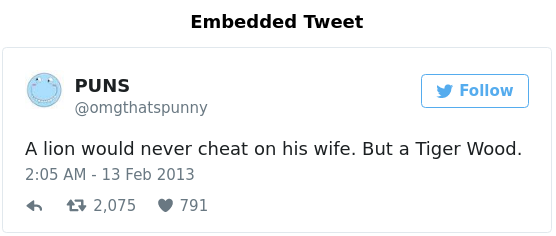
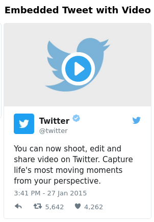
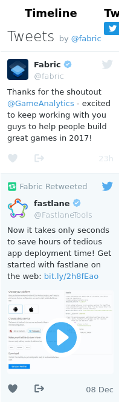
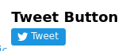
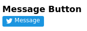

    node websiteplugins.js

proje klasöründe açılan terminale yukarıdaki satır yazıldığında proje çalışır. Twitterda açılan uygulama üzerinden Login özelliğini kullanmak için Callback Url kısmına serverın access-tokeninin yollandığı link yazılmalıdır. 

[source,javascript]
----
var Twitter = require("node-twitter-api");
----

node-twitter-api library'si Twitter endpointleri kolayca kullanılmak için webplugins.js'e eklendi. 

[source,javascript]
----
var twitter = new Twitter({
    consumerKey: "qwbOIbEbTvvPIQousRBqa052d",
    consumerSecret: "1mOQ8dViOgw0o0kxxJUSaH4XJqumQhpyAF7kcRD7RCyRxmphiq",
    callback: "http://apiornekleri-94050.onmodulus.net/access-token"
});
----

Twitter uygulama keyleri ve callbackurl'si değişkenlere atıldı.

[source,javascript]
----
app.get('/', function(req , res){
	res.sendFile('./view/index.html');
});
----

anasayfa olarak index.html gösterildi.

[source,javascript]
----
var _requestSecret;

app.get("/request-token", function(req, res) {
    twitter.getRequestToken(function(err, requestToken, requestSecret) {
        if (err)
            res.status(500).send(err);
        else {
            _requestSecret = requestSecret;
            res.redirect("https://api.twitter.com/oauth/authenticate?oauth_token=" + requestToken);
        }
    });
});
----

request-token urlsi ile Oauth tokeni istenir.

[source,javascript]
----
app.get("/access-token", function(req, res) {
   var requestToken = req.query.oauth_token,
   verifier = req.query.oauth_verifier;

   twitter.getAccessToken(requestToken, _requestSecret, verifier, function(err, accessToken, accessSecret) {
       if (err)
           res.status(500).send(err);
       else
           twitter.verifyCredentials(accessToken, accessSecret, function(err, user) {
               if (err)
                   res.status(500).send(err);
               else
                   res.send(user);
           });
   });
});
----

alınan Oauth tokeni ile istekte bulunularak Twitterdan access token alınır.

[source,javascript]
----

----

sign-in-with-twitter divine tıklandığında /request-token adresine yönlendirir.

[source,javascript]
----

----

Twitter sdk'sı yüklenir.

[source,javascript]
----

----

Twitter sdk'sının kullanılan pluginlerden önce yüklenmesi sağlandı.

[source,html]
----
<table border="0.5">

  <tr>
    <th>Login Button</th>
    <th>Embedded Tweet</th>
    <th>Embedded Tweet with Video</th>
    <th>Timeline</th>
    <th>Tweet Button</th>
    <th>Message Button</th>
    <th>Follow Button</th>

  </tr>
----

Pluginleri listelemek için tablo oluşturuldu. Örnek olarak tweet sütunu;

[source,html]
----
    <td>
      

          <blockquote class="twitter-tweet">
A lion would never cheat on his wife. But a Tiger Wood.
&mdash; Puns (@omgthatspunny) <a href="https://twitter.com/omgthatspunny/status/301482080490115072">February 13, 2013</a></blockquote>
          
      

    </td>
----

